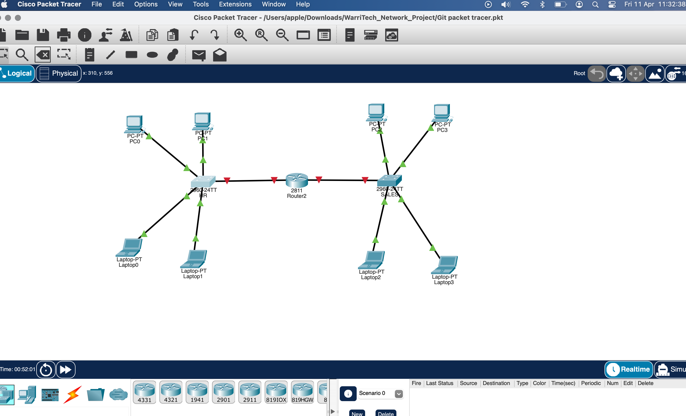

# WarriTech Solutions Office Network (Cisco Packet Tracer Project)

## 📚 Description
This project simulates a small office network for a fictional company called *WarriTech Solutions*. It demonstrates VLAN segmentation, routing, DHCP, and NAT using Cisco Packet Tracer.

## 🔧 Features
- VLAN segmentation for HR, Sales, and IT
- Router-on-a-stick configuration
- DHCP for dynamic IP address allocation
- NAT for internet access
- Basic security via ACLs

## 🖥️ Topology

## 📁 Files
- `Git packet tracer.pkt` - Main Packet Tracer project
- `configs/` - CLI configuration of router and switches
  - `Router.txt`
  - `Switch0.txt`
  - `Switch1.txt`
- `diagram.png` - Network layout (optional)

## ✅ Skills Demonstrated
- Subnetting and IP planning
- VLAN & trunking configuration
- Routing protocols
- DHCP, NAT, and ACL setup

## 👤 Author
- **otanificent**
- [GitHub Profile](https://github.com/otanificent)
